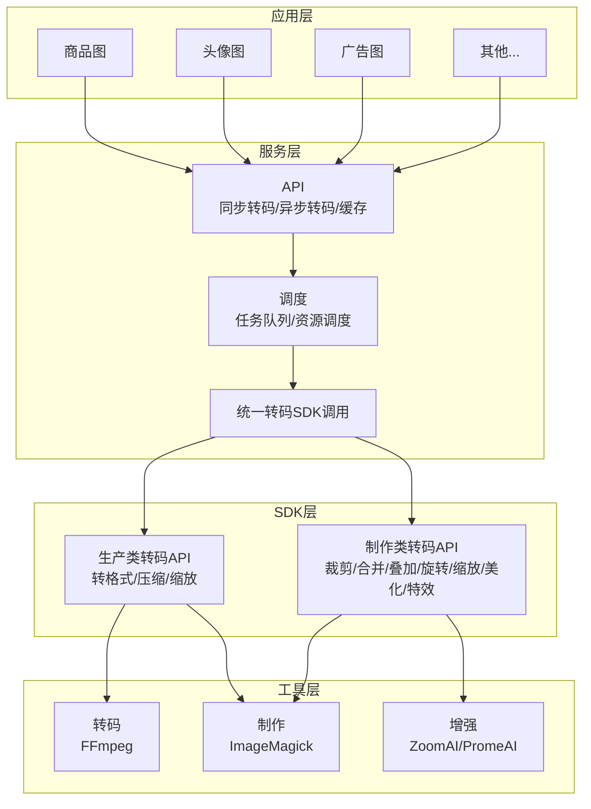
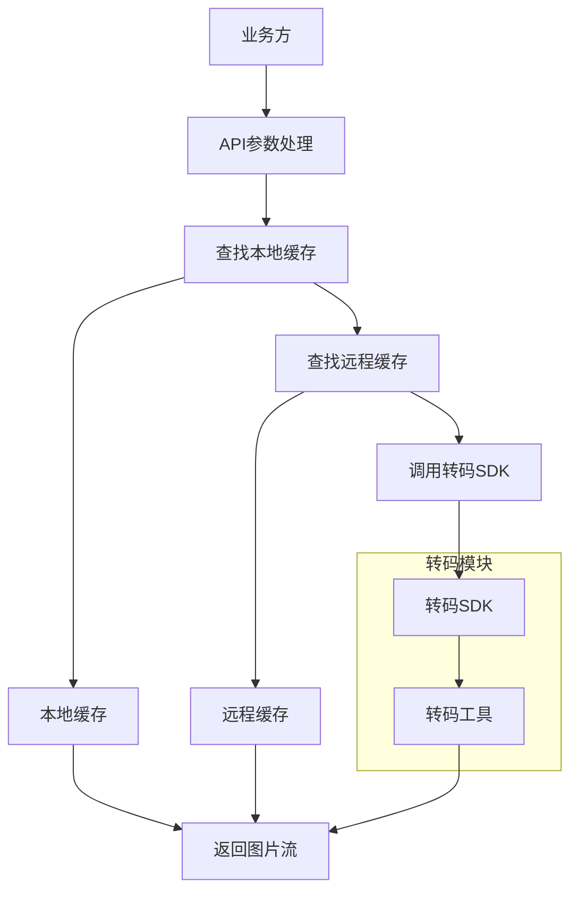
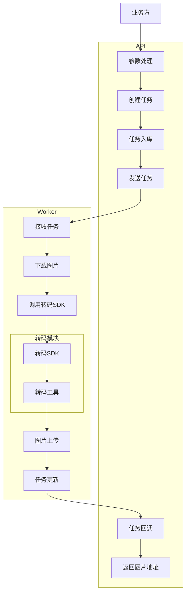

## 架构图

```mermaid
graph TD
    %% 应用层
    subgraph 应用层
        A1[商品图]
        A2[头像图]
        A3[广告图]
        A4[其他...]
    end

    %% 服务层
    subgraph 服务层
        B1[API<br>同步转码/异步转码/缓存]
        B2[调度<br>任务队列/资源调度]
        B3[统一转码SDK调用]
    end

    %% SDK层
    subgraph SDK层
        C1[生产类转码API<br>转格式/压缩/缩放]
        C2[制作类转码API<br>裁剪/合并/叠加/旋转/缩放/美化/特效]
    end

    %% 工具层
    subgraph 工具层
        D1[转码<br>FFmpeg]
        D2[制作<br>ImageMagick]
        D3[增强<br>ZoomAI/PromeAI]
    end

    %% 定义连接
    A1 --> B1
    A2 --> B1
    A3 --> B1
    A4 --> B1

    B1 --> B2
    B2 --> B3
    B3 --> C1
    B3 --> C2

    C1 --> D1
    C1 --> D2
    C2 --> D2
    C2 --> D3
```

## 转码流程

### 同步转码

```mermaid
graph TD
    %% 主流程
    A[业务方] --> B[API参数处理]
    B --> C[查找本地缓存]
    C --> D[本地缓存] --> J[返回图片流]
    C --> E[查找远程缓存]
    E --> F[远程缓存] --> J[返回图片流]
    E --> G[调用转码SDK]

    %% 转码模块
    subgraph 转码模块
        H[转码SDK] --> I[转码工具]
    end

    G --> H
    I --> J[返回图片流]

```

### 异步转码

```mermaid
graph TD
    %% 定义层次
    A[业务方] --> B[参数处理]

    subgraph API
        B --> C[创建任务]
        C --> D[任务入库]
        D --> E[发送任务]
        M[任务回调] --> N[返回图片地址]
    end

    subgraph Worker
        E --> G[接收任务]
        G --> H[下载图片]
        H --> I[调用转码SDK]

        %% 转码模块
        subgraph 转码模块
            K1[转码SDK] --> K2[转码工具]
        end

        I --> K1
        K2 --> J[图片上传]
        J --> L[任务更新]
    end

    %% 回调连接
    L --> M

```