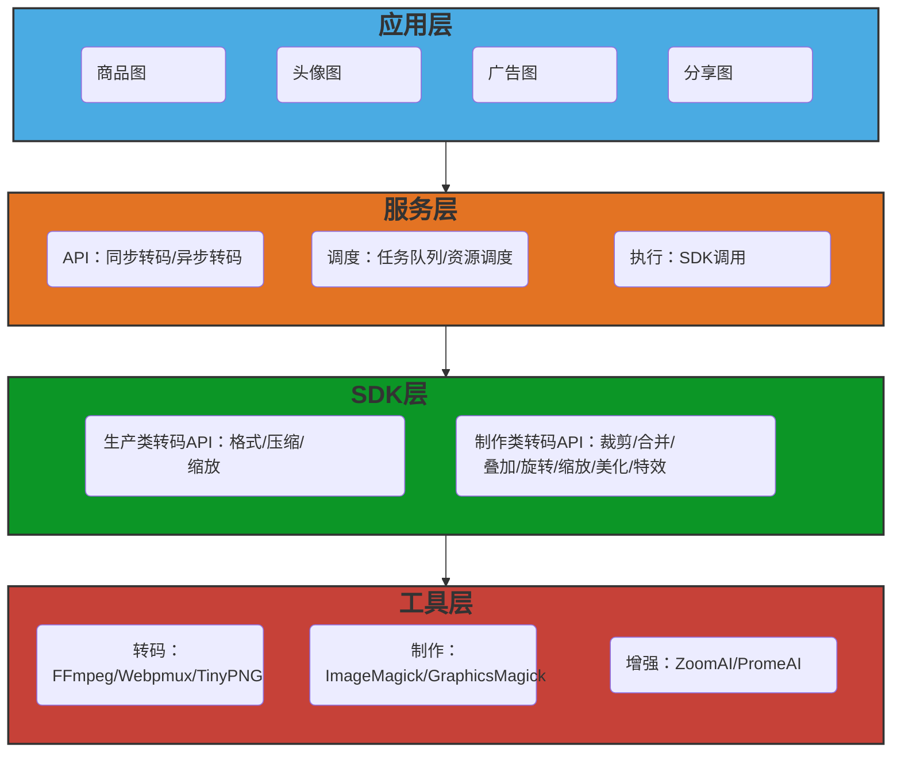

# Frog-transcode - Fast Image Processing Service

## Overview
Frog转码是面向业务需求的高性能实时以及异步图片转码服务，专门用于处理高并发的图片转码请求。服务支持多种图片格式转换、尺寸调整和压缩等。同步图片转码目标响应时间控制在 300ms 以内，异步服务控制在2s内。

## 核心特性
- 高并发支持 (10000+ QPS)
- 低延迟响应 (< 300ms)
- 图片格式转换 (支持 JPEG/PNG/WebP/AVIF)
- 图片尺寸调整 (自定义尺寸缩放和裁剪)
- 图片质量压缩 (支持自定义质量等级)
- 内存缓存机制 (支持本地内存缓存与远程缓存)

## 系统架构
<!--
| 层级    | 内容                                                                                      |
|---------|-------------------------------------------------------------------------------------------|
| 应用层  | `商品图` `头像图` `广告图` `分享图`等                                                            |
| 服务层  |  `API(同步转码/异步转码)` `调度(任务队列/资源调度)` `执行(SDK调用)`                            |
| SDK层   | `生产类转码API(格式/压缩/缩放)` `制作类转码API(裁剪/合并/叠加/旋转/缩放/美化/特效)`        |
| 工具层  | `转码(FFmpeg/Webpmux/TinyPNG)` `制作(ImageMagick/GraphicsMagick)` `增强(ZoomAI/PromeAI) `                                    |
-->



## 转码流程
[查看转码流程图](./Process.md)

## 系统目标
| 序号 | 目标               | 描述                                                                                                           |
|------|--------------------|----------------------------------------------------------------------------------------------------------------|
| 1    | 稳定性与可靠性     | 系统具备高可用性和容错性，能够在不同环境下稳定运行，保证在高并发和故障情况下提供可靠服务。支持冗余设计、自动恢复和任务持久化。 |
| 2    | 高性能与实时性     | 能够处理大量并发请求(QPS 1000)，满足高吞吐量和低延迟需求。支持实时请求和即时处理，能够在毫秒级别返回结果，适应用户按需请求图片。 |
| 3    | 功能强大与灵活性   | 支持多种图片格式的转换与压缩，提供丰富的图片制作能力，如裁剪、合并、旋转、缩放以及美化、特效等，可以将功能任意组装，满足不同场景的需求。 |
| 4    | 可维护性与可扩展性 | 系统设计简洁，易于调试和升级，采用模块化架构，支持灵活扩展，满足不断变化的业务需求，保证系统可持续发展。                             |


## 快速开始

### 环境要求
- Go 1.20 或以上
- BigCache (用于本地缓存)
- Redis (用于分布式缓存)

### 安装
1. 克隆项目
```bash
$ git clone https://github.com/frog-engine/frog-go.git
```
2. 进入项目目录
```bash
$ cd frog-go
```

3. 安装依赖
```bash
$ go mod download
$ go mod tidy
$ go mod verify
```

4. 启动服务
```bash
$ go run cmd/frog-go/main.go
# 看见启动信息
# {"level":"info","msg":"Server starting on :8080","time":"2024-12-26T19:32:54+08:00"}
```

5. 开发时热部署
```bash
# 安装 air
$ go install github.com/air-verse/air@latest

# air 初始化，生成默认配置文件
$ ~/go/bin/air init

# 查看air配置文件，修改相应目录
$ cat .air.toml

# 启动air
$ ~/go/bin/air

# 或者直接启动air，而无需.air.toml配置文件
$ ~/go/bin/air --build.cmd "go build -o tmp/main cmd/frog-go/main.go" --build.bin "./tmp/main"

### 可以查看到启动信息，修改源码就能立即生效了
[19:30:44] building...
[19:30:45] running...
{"level":"info","msg":"Server starting on :8080","time":"2024-12-26T19:30:45+08:00"}
###

```